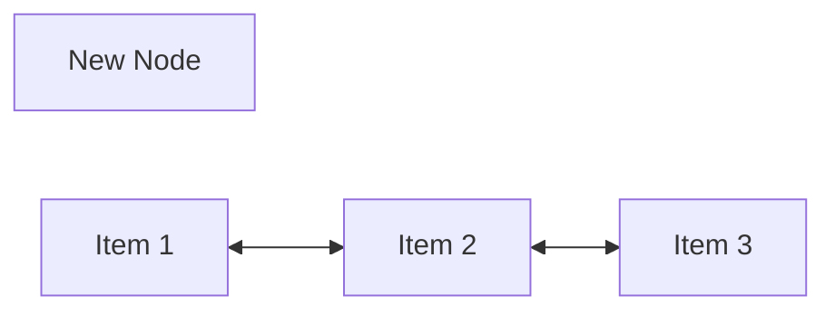
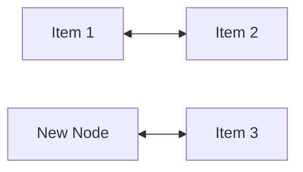
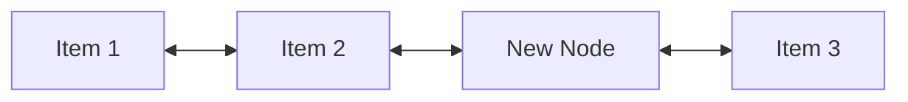

# LinkedList

An implementation of a double-linked list in Java. See source for docs.

Tested on Java 18  
java 18.0.1.1 2022-04-22  
Java(TM) SE Runtime Environment (build 18.0.1.1+2-6)  
Java HotSpot(TM) 64-Bit Server VM (build 18.0.1.1+2-6, mixed mode, sharing)

## Reference

This is a reference for the process of inserting new nodes into the list:

Either a new `LinkedList.Node` object is created or it's provided by the caller.

The new node is linked to the next node in the list.
The next node's previous reference is updated to the new node.

The next field of the pevious node is updated with a reference to the new node.
The previous reference of the new node is updated with a reference to the previous node.

## Usage

Import the `LinkedList.java` class to use it. Run the `Tester.java` class to run tests.
